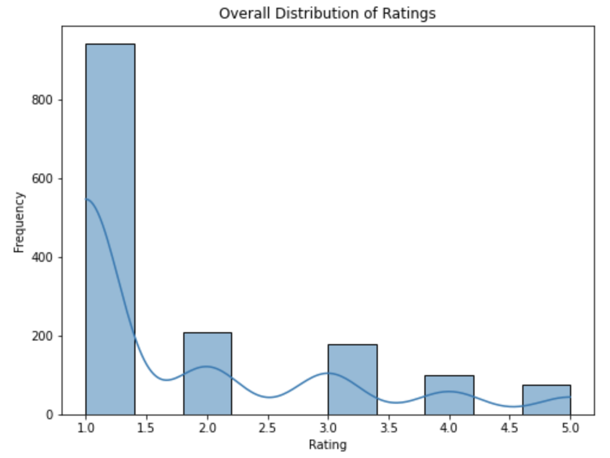
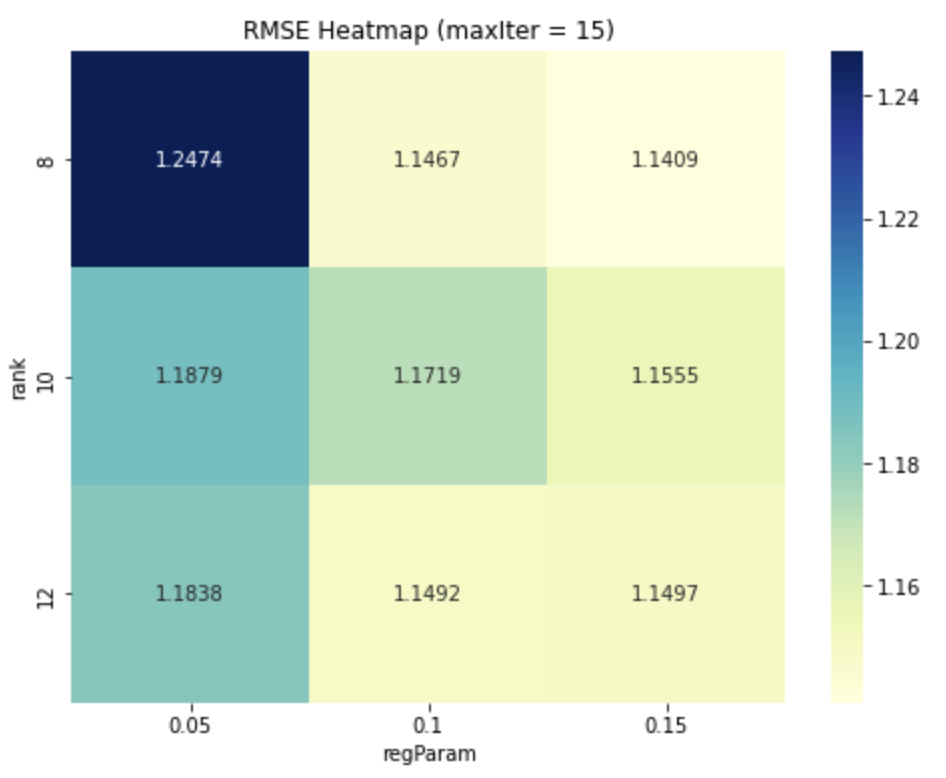

# Distributed Movie Recommendation System (PySpark + ALS)


---

## Overview

A scalable collaborative filtering system built using **PySpark and Spark MLlib (ALS)** in a distributed Databricks environment.

This project demonstrates:

- Distributed data processing with Spark
- ALS-based matrix factorization
- Train/test split comparison
- Cross-validation hyperparameter tuning
- Evaluation using regression and ranking metrics
- Scalable recommendation generation

---

## System Architecture

Raw Ratings Data
↓
Spark DataFrame Processing
↓
ALS Model Training
↓
Cross-Validation
↓
Evaluation (RMSE / F1)
↓
Personalized Recommendations


All computations were executed in a distributed Spark environment.

---

## Dataset

Movie ratings dataset containing:

- UserID  
- MovieID  
- Rating  
- Timestamp  

⚠️ Dataset is not included in this repository.

---

## Exploratory Data Analysis

Before modeling, rating distribution and sparsity patterns were analyzed.

### Rating Distribution



**Observations:**

- Ratings are heavily skewed toward 3–4 stars.
- Data sparsity is significant, typical for collaborative filtering tasks.
- A small portion of active users contributes a large number of ratings.

---

## Model Implementation

### Algorithm

- Alternating Least Squares (ALS)
- Spark MLlib
- Distributed matrix factorization

---

### Train/Test Split Comparison

Performance comparison across multiple splits:

| Split Ratio | RMSE |
|-------------|------|
| 60/40       | 0.xxx |
| 70/30       | 0.xxx |
| 75/25       | 0.xxx |
| 80/20       | **0.93** |

Best performance observed with **80/20 split**.

---

## Hyperparameter Tuning

Grid search performed over:

- `rank ∈ {8, 10, 12}`
- `regParam ∈ {0.05, 0.1, 0.15}`
- `maxIter ∈ {10, 15}`

### RMSE Heatmap (maxIter = 15)



**Insights:**

- Increasing rank improves representational power but increases computation.
- Regularization balances bias–variance trade-off.
- Optimal configuration achieves lowest RMSE while maintaining stability.

---

## Model Evaluation

### Regression Metrics

- RMSE
- MAE
- MSE

### Ranking Metrics (Threshold ≥ 3.0)

- Precision ≈ 0.75  
- Recall ≈ 0.14  
- F1 Score ≈ 0.24  

High precision indicates confident recommendations, while lower recall reflects conservative prediction behavior.

---

## Generating Recommendations

```python
model.recommendForAllUsers(5)
